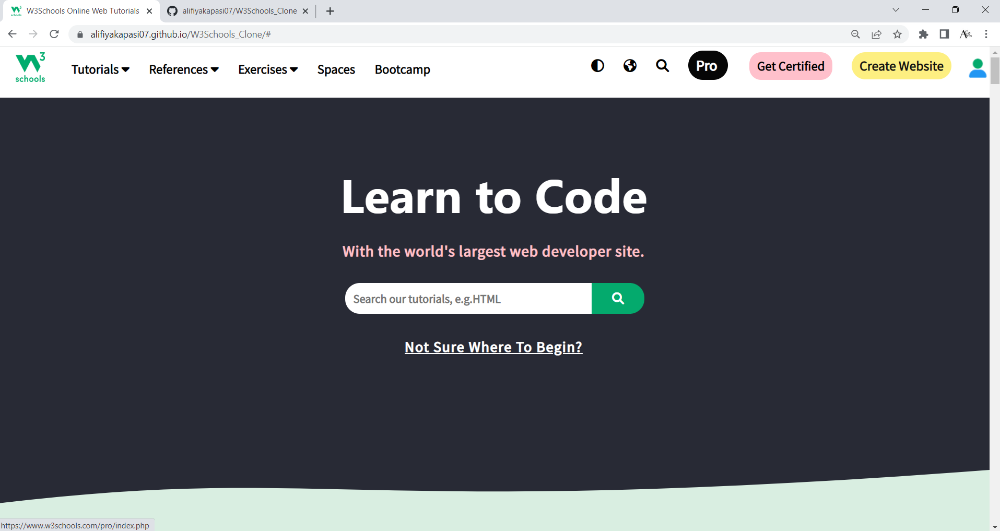
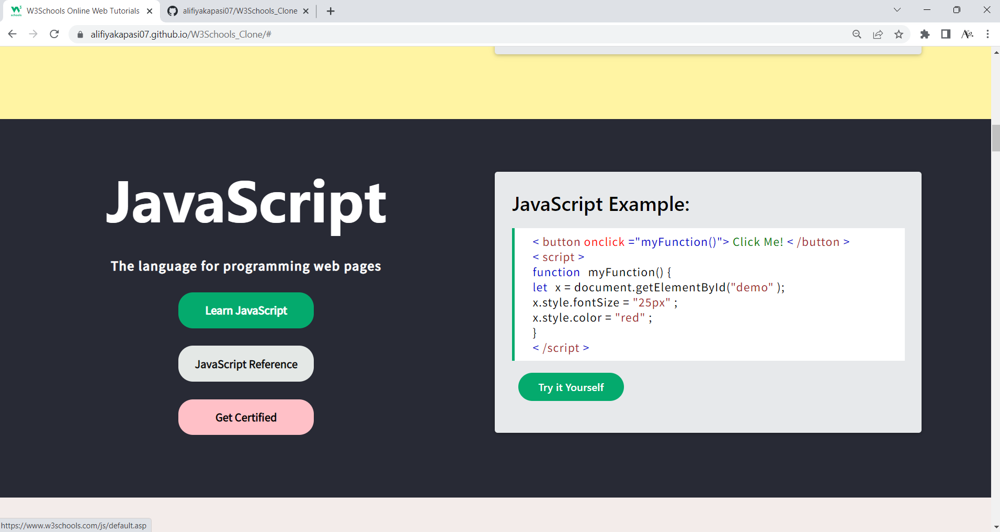
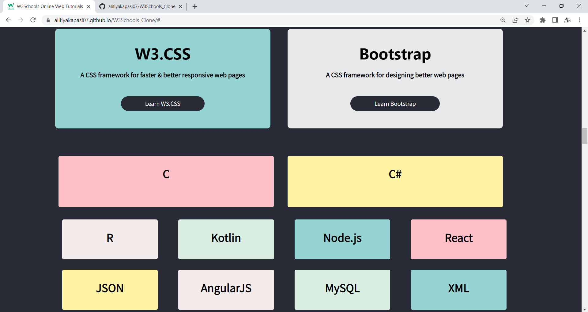
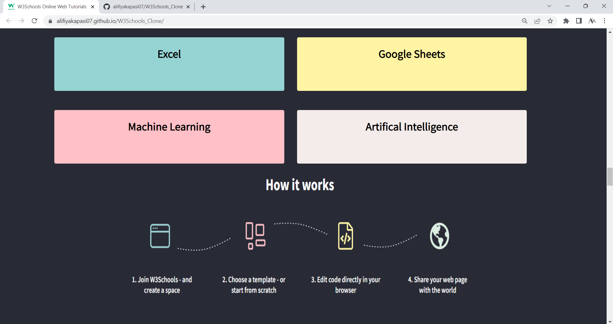
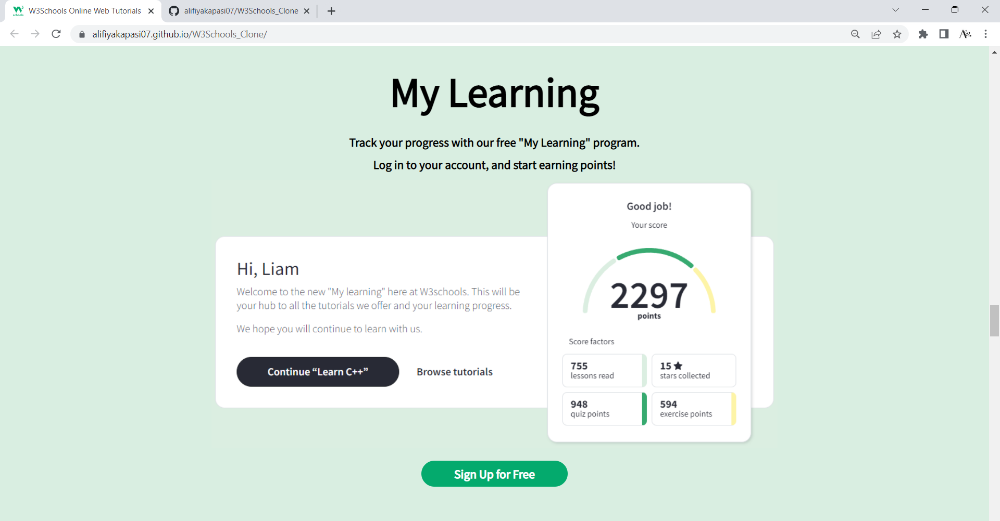

# W3Schools_Clone
> https://alifiyakapasi07.github.io/W3Schools_Clone/

## Website Preview
## Main Page

## Features

 

 

 

## Features 📋
⚡️ Fully Responsive
⚡️ Easy to modify
⚡️ Linked on button

## Sections 📚
✔️ Home\
✔️ Tutorials\
✔️ References\
✔️ Learnings\
✔️ How it works\
✔️ Become Pro, Exercise and Quiz\
✔️ Footer

## Tools Used 🛠️
* <b>GitHub Pages</b> - To host my static website (HTML, CSS, JS).
